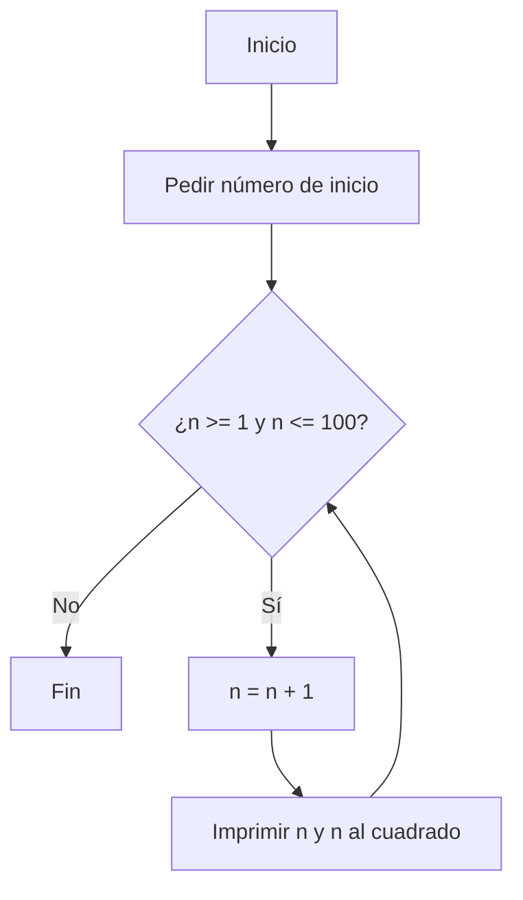
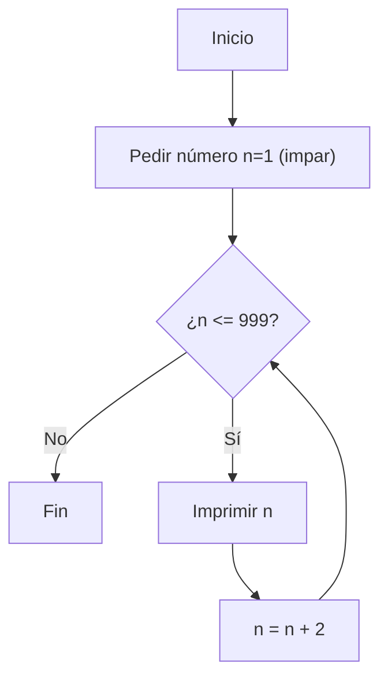
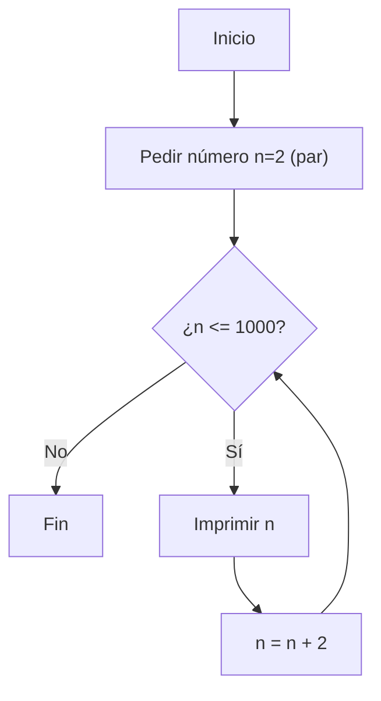
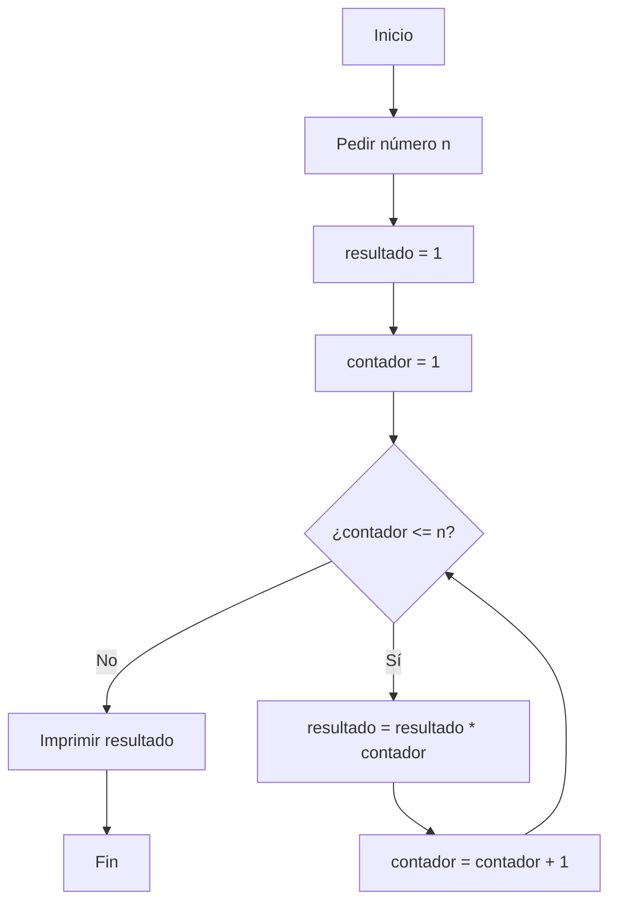
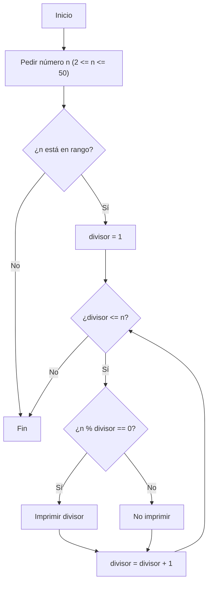
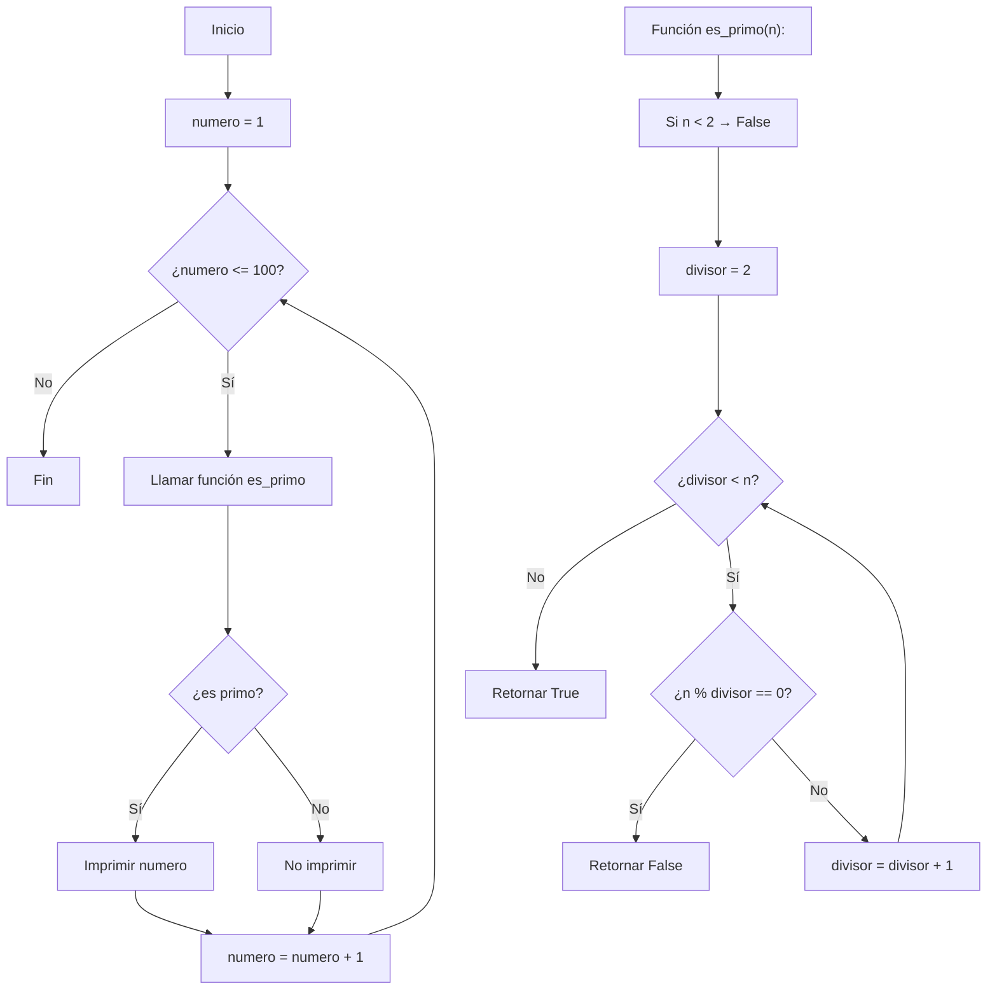

# reto_numero_6
Buenas profe, a continuación le envío el reto número 6  empleando ciclos "while"
buen día
imprimir los numeros del 1 al 100 con su respectivo cuadrado


```python
n=int(input("ingrese un numero por el que desea empezar"))
while n>=1 and n<=100:
        n+=1
        print("para el numero ", n, "su respectivo cuadrado es ", n**2)
```
Imprimir un listado con los números impares desde 1 hasta 999 y seguidamente otro listado con los números pares desde 2 hasta 1000.
Primero el de los impares hasta el 999

```python
n=int(input("ingrese un numero por el que desea empezar"))
while n>=1 and n<=100:
        n+=1
        print("para el numero ", n, "su respectivo cuadrado es ", n**2)
```
ahora el de los pares desde el 2 hasta el 1000

```python
#listado numeros pares
s=int(input("ingrese un numero par desde el cual quiere empezar la cuenta para los pares"))
while s>=0 and s<1000:
        s+=2
        print(s)
```
Imprimir los números pares en forma descendente hasta 2 que son menores o iguales a un número natural n ≥ 2 dado

```python
n=int(input("ingrese el numero por que le quiere empezar la cuenta calidoso"))
while n>2:
        if n%2!= 0:
                n-=1
        n-=2
        print(n)
#tambien se le pueden meter impares
```
Imprimir el factorial de un número natural n dado.

```python
n = int(input("Ingrese un número para calcular el factorial: "))
resultado = 1
contador = 1

while contador <= n:
    resultado *= contador
    contador += 1

print("el factorial de ", n , "es", resultado)
```
Implementar un programa que ingrese un número de 2 a 50 y muestre sus divisores

```python
n = int(input("Ingrese un número entre 2 y 50: "))
if n < 2 or n > 50:
    print("ese numero no está en el rango crack")
divisor=1
while divisor <= n:
        if n % divisor == 0:
            print(divisor)
        divisor += 1
```
Implementar el algoritmo que muestre los números primos del 1 al 100. Nota: use funciones

```python

def es_primo(n):
    if n < 2:
        return False
    divisor = 2
    while divisor < n:
        if n % divisor == 0:
            return False  # si se puede dividir no es primo
        divisor += 1
    return True  # si no encontró divisores es primo
def mostrar_primos():
    numero = 1
    print(" Números primos del 1 al 100:")
    while numero <= 100:
        if es_primo(numero):
            print(numero)
        numero += 1


# Llamamos la función para que arranque
mostrar_primos()
```


